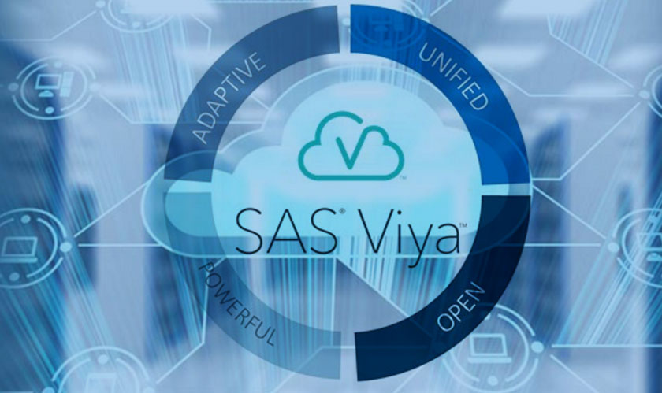
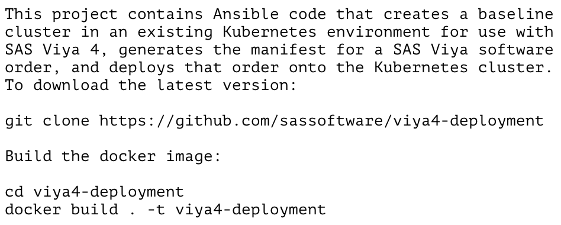
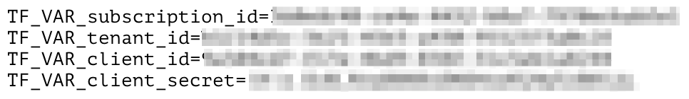
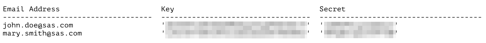
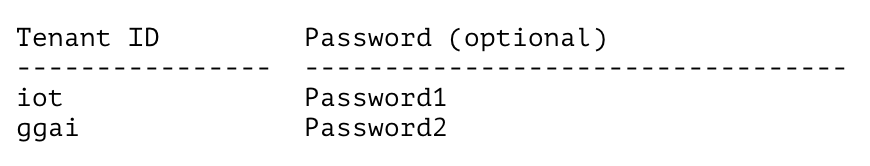

# Administering and managing Viya4 Cloud environments with Viya_Manager

A tutorial that introduces Viya_Manager, an interface to simplify the administration and management of Viya 4 environments on the Cloud.

## Table of Contents

* [Overview](#overview)
* [Getting Started](#getting-started)
	* [Prerequisites](#prerequisites)
	* [Installation](#installation)
  	* [Viya4 Tools](#viya4-tools)
		* [Cloud Provider Credentials](#cloud-providers-credentials)
		* [SAS API Portal Credentials](#sas-api-portal-credentials)
	* [Running Viya_Manager](#running-viya_manager)
		* [Cloud Infrastructure Tasks](#cloud-infrastructure)
			* [-Apply](#cloud-infrastructure)
			* [-Destroy](#cloud-infrastructure)
			* [-Output](#cloud-infrastructure)
			* [-Plan](#cloud-infrastructure)
		* [Viya Installation Tasks](#viya-installation)
			* [-Install](#viya-installation)
			* [-Uninstall](#viya-installation)
			* [-Upgrade](#viya-installation)
		* [Viya Management Tasks](#viya-management)
			* [-Gencert](#viya-management)
			* [-Kubesync](#viya-management)
   			* [-Operator](#viya-management)
			* [-Start](#viya-management)
			* [-Stop](#viya-management)
			* [-Status](#viya-management)
			* [-Version](#viya-management)
	* [Examples](#examples)
	* [Troubleshooting](#troubleshooting)
		* [Timeout error on Google Cloud deployments](#timeout-error-on-google-cloud-deployments)
* [Conclusion](#conclusion)
* [Contributing](#contributing)
* [License](#license)
* [Additional Resources](#additional-resources)

[&#11014;](#top) Top
## Overview

The wide range of Viya 4 offerings include support for all the major cloud providers. While this is welcome news for our customers, it is also the cause of some headaches among Viya installers who must juggle with deployment procedures that vary depending on how and where the software is laid out. This is particularly true for the portion of the installation that deals with the creation and configuration of the Kubernetes cluster on which Viya 4 runs, given the fact that each cloud provider relies on its own proprietary infrastructure. To help system administrators navigate through these nuances, SAS has launched and maintains a set of Github projects called SAS Viya4 Deployment, SAS Viya4 Infrastructure as Code (IaC), and SAS Viya4 Orders CLI.



SAS Viya4 Deployment is used to download and install a Viya order on an existing Kubernetes cluster. As part of the installation, some minimal configuration is provided for some components like, for instance, LDAP. The entire process is driven by a configuration file the installer is expected to customize in advance. Perhaps the biggest benefit of SAS Viya4 Deployment lays in the fact that its configuration file is not dependent on the cloud provider being used. In other words, a configuration file that works on Azure can also work, without modifications, on AWS or GCP.

SAS Viya4 Infrastructure as Code (IaC) is used to create the infrastructure on which Viya runs. Like SAS Viya4 Deployment, it relies on a configuration file which must be customized according to the installation needs. The content of the file varies based on the Cloud provider being used.

SAS Viya4 Orders CLI is used to handle the downloading of assets, certificates, and license files which are used to install and maintain Viya. Use of this tool is not required for the initial installation of the software, as the required files are automatically downloaded by the SAS Viya4 Deployment tool.

Going through the specifics of each one of the tools mentioned above is out-of-scope with this document, as the paper is instead centered around an infrastructure management tool called Viya_Manager. The tool was developed by the IoT Enablement Team with the objective to create a hub to administer deployments of separate Viya4 environments across different Cloud providers. Viya_Manager automates the entire deployment cycle by leveraging each of the three tools mentioned earlier.

[&#11014;](#top) Top
## Getting Started

Before using Viya_Manager, make sure to review the list of pre-requisites, install any software that might be required, and customize configuration and credential files for each Cloud provider as needed.

[&#11014;](#top) Top
### Prerequisites

Viya_Manager runs on Unix platforms only. The following prerequisites must be met before it can be used:

- The **kubectl** and **kustomize** utilities must be installed on the server where Viya_Manager runs;
- A local Docker instance is required for the installation of the SAS Viya4 Infrastructure as Code (IaC), the SAS Viya4 Deployment, and the SAS Viya4 Orders CLI tools.
- Each Cloud provider requires a set of templates:
 	- A template for the SAS Viya4 IaC tool containing Cloud infrastructure settings;
	- A template for the SAS Viya4 Deployment tool containing Viya deployment settings;
	- A template storing the list of regions where the cluster can be defined.
- Each Cloud provider requires a set of credential files:
	- A file containing credentials to connect to the Cloud provider;
	- For multi-tenant environments only, a file containing the list of tenant IDs and optional passwords for their **sasprovider** user;
	- A file containing a list of email addresses and corresponding keys and secrets for users authorized to access Viya4 software orders.

[&#11014;](#top) Top
### Installation
 
Download the tarred ZIP [<ins>file</ins>](Code/Viya_Manager.tar.gz) containing Viya_Manager on a Unix server, and unpack it on your home folder using the following command:
```
wget --no-check-certificate https://github.com/sassoftware/iot-manage-viya-4-cloud-environments-with-viya_manager/raw/refs/heads/main/Code/Viya_Manager.tar.gz -O- -q | tar xzv --warning=no-unknown-keyword --exclude='._*' [ --dir=${Viya_Manager root folder} ]
```
Where **--dir** specifies the folder where to install Viya_Manager. If not provided, the option will default to the current folder.

<details><summary><b><i>Click</i></b> to view the directory structure generated by the execution of the command:</summary>
<p>

```
  Viya_Manager
  ├── Cloud-Providers
  │   ├── aws
  │   │   ├── Clusters
  │   │   ├── Credentials
  │   │   │   ├── aws-credentials
  │   │   │   ├── aws-credentials.paige
  │   │   │   ├── README.md
  │   │   │   ├── sas_api
  │   │   │   └── tenants
  │   │   └── Templates
  │   │       ├── aws.cfg.template
  │   │       ├── locations.aws.template
  │   │       ├── README.md
  │   │       └── viya.cfg.template
  │   ├── azure
  │   │   ├── Clusters
  │   │   ├── Credentials
  │   │   │   ├── azure-credentials
  │   │   │   ├── README.md
  │   │   │   ├── sas_api
  │   │   │   └── tenants
  │   │   └── Templates
  │   │       ├── azure.cfg.template
  │   │       ├── azure-vpn.cfg.template
  │   │       ├── locations.azure.template
  │   │       ├── README.md
  │   │       └── viya.cfg.template
  │   └── gcp
  │       ├── Clusters
  │       ├── Credentials
  │       │   ├── gcp-credentials
  │       │   ├── gcp-service-account.json
  │       │   ├── README.md
  │       │   ├── sas_api
  │       │   └── tenants
  │       └── Templates
  │           ├── gcp.cfg.template
  │           ├── locations.gcp.template
  │           ├── README.md
  │           └── viya.cfg.template
  ├── Management
  │   ├── Deployment
  │   │   ├── Manual
  │   │   │   ├── Deploy
  │   │   │   ├── Kustomize
  │   │   │   └── README.md
  │   │   ├── Operator
  │   │   │   ├── Deploy
  │   │   │   ├── README.md
  │   │   │   └── SASDeployment
  │   │   └── README.md
  │   ├── ssh_m
  │   └── Viya_Manager
  └── Viya4-Github-Projects
      ├── viya4-deployment
      │   └── README.md
      ├── viya4-iac-aws
      │   └── README.md
      ├── viya4-iac-azure
      │   └── README.md
      ├── viya4-iac-gcp
      │   └── README.md
      └── viya4-orders-cli
          └── README.md
```
Where:

- **Cloud-Providers** holds a subfolder for each supported Cloud provider (**AWS**, **Azure**, and **GCP**). Each subfolder stores three additional entries, **Clusters**, **Credentials**, and **Templates**:
	- **Clusters** contains an entry for every cluster created through Viya_Manager for that specific provider. It can also contain a folder called **Customizations** which holds customized Kubernetes manifests for Viya components. The following list of files and directories are located inside each cluster's folder:
		- Configuration files for the cluster's infrastructure and for the Viya deployment;
		- The KUBECONFIG file to access the cluster;
		- An optional **Keys** folder with the identity key to access the Jump and/or NFS servers if a public IP address was configured for them;
		- A **License-and-certificates** folder containing the license and certificates files for the SAS software order;
		- An **Order** directory storing the asset file for the software order;
		- A **sas-viya-deployment** folder storing the Kubernetes manifests for Viya;
		- An optional **sas-deployment-operator** folder storing the manifests for the Deployment Operator, if installed;
		- An optional file called **sas-viya-sasdeployment.yaml** representing the manifest generated for the Deployment Operator when Viya is deployed using that tool.
	- **Credentials** contains:
		- One or more credential files to access individual subscriptions for the Cloud provider;
		- One or more files containing tenant IDs and optional passwords for their **sasprovider** user when installing Viya in multi-tenant mode;
		- A credential file to access the SAS API portal;
	- **Templates** stores:
		- A Cloud provider configuration template used by the SAS Viya4 Infrastructure as Code tool;
		- A Viya configuration template used by the SAS Viya4 Deployment tool;
		- A file containing the list of regions for the Cloud provider where a cluster can be created.
- **Management** is the folder that stores the Viya_Manager code. The following are found inside it:
	- **Viya_Manager**;
	- A **Deployment** subfolder containing a **Manual** and an **Operator** directory, each holding a set of scripts for the manual and automated deployment of Viya (through the Deployment Operator).
- **Viya4-Github-Projects** contains a subfolder for each of the tools that are required to support the deployment and removal of Cloud resources:
 	- **viya4-deployment** stores a README.md file with step-by-step instructions on how to install SAS Viya4 Deployment on Docker;
	- **viya4-iac-aws** stores a README.md file with step-by-step instructions on how to install SAS Viya4 IaC for AWS on Docker;
	- **viya4-iac-azure** stores a README.md file with step-by-step instructions on how to install SAS Viya4 IaC for Azure on Docker;
	- **viya4-iac-gcp** stores a README.md file with step-by-step instructions on how to install SAS Viya4 IaC for GCP on Docker;
	- **viya4-orders-cli** stores a README.md file with step-by-step instructions on how to install SAS Viya4 Orders CLI on Docker.

</p>
</details>

[&#11014;](#top) Top
#### Viya4 tools

Make sure a local instance of Docker is up and running before proceeding with the installation of the required SAS Viya4 tools.

Change folder to **$HOME/Viya_Manager/Viya4-Github-Projects**, and follow the instructions inside the **README.md** file for each project to deploy their images to Docker. For example:

<table align="center"><tr><td align="center" width="9999">

</td></tr></table>

>>>
_IMPORTANT:_ **SAS is committed to maintaining the Viya4 Github tools. Therefore, it's highly recommended that such tools be re-installed at regular intervals to take advantage of newly added features and fixes. Re-installing the tools doesn't cause any adverse impact on the configuration of pre-existing deployments.**
>>>

[&#11014;](#top) Top
#### Cloud Provider Credentials

This step involves the customization of the files containing the credentials to connect to the Cloud providers. The files are provided as part of the installation and are pre-configured to accept the user's credentials. They are stored in the **$HOME/Viya_Manager/Cloud-Providers/\<provider\>/Credentials/** folder, and are called **\<provider\>-credentials**, with **\<provider\>** being one among **aws**, **azure**, or **gcp**. Below is an example of a credential file for Azure:

<table align="center"><tr><td align="center" width="9999">

</td></tr></table>

To learn more on the authentication process for each provider use the following links:

| Provider | Authentication link |
| -------- | ------------------- |
| AWS   | https://github.com/sassoftware/viya4-iac-aws/blob/main/docs/user/TerraformAWSAuthentication.md |
| Azure | https://github.com/sassoftware/viya4-iac-azure/blob/main/docs/user/TerraformAzureAuthentication.md |
| GCP   | https://github.com/sassoftware/viya4-iac-gcp/blob/main/docs/user/TerraformGCPAuthentication.md |

[&#11014;](#top) Top
#### SAS API Portal Credentials

Another set of credentials is required to access the SAS Portal. The file is called **sas_api**, and is located in the **$HOME/Viya_Manager/Cloud-Providers/\<provider\>/Credentials/** folder. Access to a SAS software order can be given to one or multiple users. The credential file needs to have at least one entry with the email address of an individual with access rights, along with their key and secret. Log on to the SAS API Portal website (https://apiportal.sas.com/) to generate them before installing Viya. Both the user’s key and secret need to be wrapped in single quotes as shown in the following example:

<table align="center"><tr><td align="center" width="9999">

</td></tr></table>

[&#11014;](#top) Top
#### Multi-tenancy

When installing Viya in multi-tenant mode, a file containing the list of tenants and optional passwords for their **sasprovider** id must be provided. The  file must be located in the **$HOME/Viya_Manager/Cloud-Providers/\<provider\>/Credentials/** folder. As of the writing of this tutorial, the following rules must be observed when choosing tenant IDs:

>>>
- Must start with a letter
- Must be specified in lowercase
- Must contain letters and numbers only. No special characters or symbols
- Cannot start with "***sas***"
- Cannot use the following reserved names: 
	- "***default***" 
	- "***provider***"
	- "***shared***"
	- "***sharedservices***"
	- "***spre***"
	- "***uaa***"
	- "***viya***"
- Cannot be longer than 16 characters
- The name of the ***provider*** tenant is "***uaa***"
- Once defined, tenant IDs cannot be changed
>>>

Below is an example of a tenant IDs file:

<table align="center"><tr><td align="center" width="9999">

</td></tr></table>

[&#11014;](#top) Top
### Running Viya_Manager

Viya_Manager is an infrastructure tool designed to ease the administration and maintenance of Viya 4 environments across multiple Cloud providers. The tool is written in Unix scripting and was built to be portable to run on any Unix platform, inside or outside of the SAS network. Moreover, it doesn’t require higher privileges to be executed as it relies on external credentials to perform its various tasks on the Cloud.

When called from the command line without parameters (or with the -h or -help option), it returns a menu with the full list of options available to the administrator:
```
- Viya 4 Manager

  Syntax:

  Viya_Manager [ -h | -help ]
               [ -apply -cluster <cluster name> -provider <AZURE | AWS | GCP | K8S> [ -location <location> ] [ -credentials <file name> ] [ -template <file name> ] [ -inventory <file name> ] [ -vars <file name> ] [ -v | -verbose ] ]
               [ -destroy -cluster <cluster name> -provider <AZURE | AWS | GCP> [ -remove_cfg ] [ -credentials <file name> ] [ -v | -verbose ] ]
               [ -output -cluster <cluster name> -provider <AZURE | AWS | GCP> [ -credentials <file name> ] ]
               [ -plan -cluster <cluster name> -provider <AZURE | AWS | GCP | K8S> [ -location <location> ] [ -credentials <file name> ] [ -template <file name> ] [ -inventory <file name> ] [ -vars <file name> ] [ -v | -verbose ] ]
               [ -install -cluster <cluster name> -provider <AZURE | AWS | GCP | K8S> -order <order number> -cadence <Viya cadence> -type <LTS | STABLE> -email <email> [ -template <file name> ] [ -tenant_list <file name> [ -onboard ]] [ -domain <domain name> ] [ -v | -verbose ] ]
               [ -uninstall -cluster <cluster name> -provider <AZURE | AWS | GCP> [ -tenant_list <file name> ] [ -v | -verbose ] ]
               [ -upgrade -cluster <cluster name> -provider <AZURE | AWS | GCP | K8S> -order <order number> -cadence <Viya cadence> -type <LTS | STABLE> -email <email> [ -deploy ] [ -v | -verbose ] ]
               [ -operator <-install [ -noseccomp ] | -uninstall> -cluster <cluster name> -provider <AZURE | AWS | GCP> ]
               [ -start <Viya | CAS_Controller [-tenant <tenant ID> ]> -cluster <cluster name> -provider <AZURE | AWS | GCP> ]
               [ -stop <Viya | CAS_Controller [-tenant <tenant ID> ]> -cluster <cluster name> -provider <AZURE | AWS | GCP> ]
               [ -gencert -cluster <cluster name> -provider <AZURE | AWS | GCP>]
               [ -kubesync -cluster <cluster name> -provider <AZURE | AWS | GCP | K8S> ]
               [ -status -cluster <cluster name> -provider <AZURE | AWS | GCP> ]
               [ -version -cluster <cluster name> -provider <AZURE | AWS | GCP> ]

  Where:

  -apply                                 : Creates and deploys the cluster infrastructure
  -destroy                               : Removes all resources associated with an existing cluster
  -output                                : Displays a summary of settings for an existing cluster
  -plan                                  : Displays a preview of the cloud resources before creating the cluster
  -install                               : On-boards tenants or deploys Viya. It assumes the cluster already exists
  -uninstall                             : Off-boards tenants or uninstalls Viya
  -upgrade                               : Downloads a new copy of the Viya software order, including assets, license and certificates
  -operator                              : Installs or removes the Viya Deployment Operator
  -start                                 : Starts Viya or the CAS Controller(s)
  -stop                                  : Stops Viya or the CAS Controller(s)
  -gencert                               : Generates a certificate in PEM format for client browsers
  -kubesync                              : Synchronizes the client and server version of kubectl
  -status                                : Displays the status of the Viya pods
  -version                               : Displays the Viya version.
  -h | -help                             : Displays the syntax for the Viya_Manager utility.

  Sub-parameters:

  -cluster                               : A valid cluster name
  -credentials                           : The cloud provider's credentials file. Default is <provider>-credentials.
  -location                              : The physical location of the cloud resources. Default is East US.
  -provider                              : The cloud provider (Azure, AWS, or GCP)
  -template                              : For cloud-related options, the template file to use when generating the cloud infrastructure. Default is <provider>.cfg.template.
                                           For Viya, the template file to use when installing the software. Default is viya.cfg.template.
  -inventory                             : For Open Source Kubernetes (K8S), the template file with the FQDNs/IP addresses of the cluster's nodes. Default is k8s.inventory.template. Ignored for all other providers
  -vars                                  : For Open Source Kubernetes (K8S), the template file with VSPHERE-related options. Default is k8s.ansible-vars.template. Ignored for all other providers
  -order                                 : The Viya order to install
  -cadence                               : The order's cadence
  -type                                  : The cadence type (LTS or STABLE). Default is LTS
  -email                                 : The email address of an user with download privileges on the order
  -deploy                                : When updating an existing Viya software order, whether to deploy the changes. It assumes the Viya Deployment Operator is installed
  -noseccomp                             : Installs the Viya Deployment Operator on a cluster that does not support Secure Compute Mode
  -tenant                                : The tenant ID associated with the CAS Controller to stop/start
  -tenant_list                           : The file containing the list of tenants to create when installing Viya
  -onboard                               : On-board tenants after installing Viya
  -domain                                : Domain name for Viya and monitoring services
  -remove_cfg                            : When removing a cluster, erases its configuration folder from disk
  -v | -verbose                          : Generates verbose for the operation being performed
  ```
The list of options can be categorized in three logical areas:

- [Cloud infrastructure](#cloud-infrastructure)
- [Viya installation](#viya-installation)
- [Viya management](#viya-management)

[&#11014;](#top) Top
#### Cloud Infrastructure

Four Viya_Manager options apply to the Cloud provider cluster infrastructure:

- [-Apply](./Options/Cloud%20Infrastructure/apply.md)
- [-Destroy](./Options/Cloud%20Infrastructure/destroy.md)
- [-Output](./Options/Cloud%20Infrastructure/output.md)
- [-Plan](./Options/Cloud%20Infrastructure/plan.md)

[&#11014;](#top) Top
#### Viya Installation

Two Viya_Manager options apply to the Viya installation:

- [-Install](./Options/Viya%20Installation/install.md)
- [-Uninstall](./Options/Viya%20Installation/uninstall.md)
- [-Upgrade](./Options/Viya%20Installation/upgrade_cluster.md)

[&#11014;](#top) Top
##### NFS Storage considerations

A file server that uses the network file system (NFS) protocol is the minimum requirement for SAS Viya. The installer has the choice of whether to use default storage settings, or customize the Viya template file in order to map external storage accordingly. If you are bringing your own NFS-compliant server, which is the case when Viya is installed using the default template file, **the following NFS exports folder structure must be created on the NFS server prior to installing Viya**:
```
/<export_dir>            <- NFS export path (In Viya_Manager's case this is set to /export by default)
   /pvs                  <- Location for persistent volumes
   /<Viya namespace>     <- Viya namespace folder
      /bin               <- Default folder for open source directories
      /data              <- Default folder for SAS and CAS data
      /homes             <- Default location for user home folders
      /astores           <- Default location for astores
```
Note that the above directory structure doesn't have to be created when the **V4_CFG_MANAGE_STORAGE** option in the Viya deployment template file and the **CREATE_JUMP_VM** option in the Cloud Provider template file are set to **true**.

[&#11014;](#top) Top
#### Viya Management

Five Viya_Manager options apply to the Viya installation:

- [-Gencert](./Options/Viya%20Management/gencert.md)
- [-Kubesync](./Options/Viya%20Management/kubesync.md)
- [-Operator](./Options/Viya%20Management/operator.md)
- [-Start](./Options/Viya%20Management/start.md)
- [-Stop](./Options/Viya%20Management/stop.md)
- [-Status](./Options/Viya%20Management/status.md)
- [-Version](./Options/Viya%20Management/version.md)

[&#11014;](#top) Top
### Examples

1. [Creating a cluster on AWS and deploying Viya on it](./Examples/AWS%20Simple%20Deployment.md)
2. [Deploying a multi-tenant Viya installation on Azure](./Examples/Azure%20Multi-tenant%20Deployment.md)

[&#11014;](#top) Top
## Troubleshooting

For Viya_Manager to run without errors, the entire list of prerequisites must be satisfied. Make sure to go through each one of them before attempting to create and/or manage a Viya 4 installation. Once the requirements are in place, in the event any of the infrastructure or deployment tasks fail, they can be executed again as the execution will resume from the last checkpoint. If the failure persists, it is recommended to investigate the problem using the Cloud provider console if the issues relates to infrastructure, or by opening a ticket with the SAS Technical Support if the problem shows during the installation of Viya. To troubleshoot problems with the Kubernetes cluster, it is recommended that you use a tool like **[Lens](https://k8slens.dev/)**, or ask someone to help you do the same if you are not familiar with Kubernetes.
Fianlly, even tough the Viya_Manager code is provided in clear, it is recommended not to make modifications to it to avoid problems that could lead to the incorrect execution of its tasks.

### Timeout error on Google Cloud deployments

There might be times, during a cluster deployment, when an error similar to the following appears:
~~~
E0408 23:01:46.163956   23220 memcache.go:287] couldn't get resource list for metrics.k8s.io/v1beta1: the server is currently unable to handle the request
~~~
Re-running the deployment (and choosing to replace the cluster's configuration folder) generally fixes the issue. For instance:
~~~
> ./Viya_Manager -apply -cluster viya-gcp-1 -provider gcp -v

- Creating cluster infrastructure for viya-gcp-1...
- The GCP configuration file for viya-gcp-1 already exists.
- Would you like to replace it? (y/n) Y
....
~~~

[&#11014;](#top) Top
# Conclusion

Creating and managing Viya 4 environments can present some challenges, especially when they require to be installed and configured across a variety of Cloud providers. This tutorial shows how this task can be eased through the use of Viya_Manager, a tool designed to shield administrators from the complexities that come from having to deal with unique proprietary infrastructures. By using templates, Viya_Manager allows for each installation to be customized to meet different kinds of requirements. Moreover, Viya_Manager provides a central point of administration that makes it easier to apply changes to both the cloud infrastructure and the Viya software that runs on it. The result is the ability to stand up Viya 4 environments using a fraction of the time they required in the past thanks to the flexibility offered by this solution.

[&#11014;](#top) Top
# Contributing

This project does not accept contributions.

[&#11014;](#top) Top
# License

This project uses the SAS License Agreement for Corrective Code or Additional Functionality.  Please see license file for additional detail.

[&#11014;](#top) Top
# Additional Resources

* [SAS Viya Orders CLI](https://github.com/sassoftware/viya4-orders-cli)
* [SAS Viya 4 Deployment](https://github.com/sassoftware/viya4-deployment)
* [SAS Viya 4 Infrastructure as Code for AWS](https://github.com/sassoftware/viya4-iac-aws)
* [SAS Viya 4 Infrastructure as Code for Azure](https://github.com/sassoftware/viya4-iac-azure)
* [SAS Viya 4 Infrastructure as Code for GCP](https://github.com/sassoftware/viya4-iac-gcp)
* [SAS Viya Install Center](https://support.sas.com/en/documentation/install-center/viya.html)
* [SAS API Portal](https://apiportal.sas.com/)
